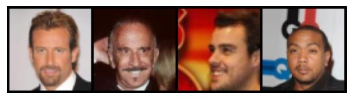
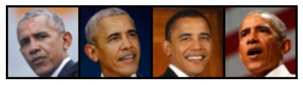

## Few Shot Sets

Listed from farthest to closest domain distance:

##### [Simpsons Face](https://www.kaggle.com/kostastokis/simpsons-faces)

 $d = 0.834322 \pm 0.002386$

*Note: way more than 100 to choose from, we would likely want to remove any not well cropped images (e.g. image #2) from our "few shot" set*

##### [100-shot-panda](https://data-efficient-gans.mit.edu/datasets/)

 $d = 0.720260 \pm 0.002163$ 

##### [100-shot-dog](https://data-efficient-gans.mit.edu/datasets/)

 $d = 0.693299 \pm 0.002752$ 

##### [100-shot-cat](https://data-efficient-gans.mit.edu/datasets/)

 $d = 0.683711 \pm 0.002693$ 

##### [100-shot-grumpy-cat](https://data-efficient-gans.mit.edu/datasets/)

 $d = 0.669543 \pm 0.002296$ 

##### CelebA_Bald (Subset of CelebA : 2.24%)

 $d = 0.64849 \pm 0.00308$ 

##### CelebA_Eyeglasses (Subset of CelebA : 6.51%)

 $d = 0.64538 \pm 0.00347$ 

##### CelebA_Mustache (Subset of CelebA : 4.15%)

 $d = 0.64148 \pm 0.00334$ 

##### [100-shot-obama](https://data-efficient-gans.mit.edu/datasets/)

 $d = 0.639513 \pm 0.002368$ 

##### CelebA_Gray_Hair (Subset of CelebA : 4.19%)

 $d = 0.63210 \pm 0.00318$ 

##### CelebA_Heavy_Makeup (Subset of CelebA : 38.69%)

 $d = 0.62494 \pm 0.00286$ 

### Other Dataset Options

[UTKFace](https://susanqq.github.io/UTKFace/): 20K face images with labels embedded in the file name (`[age]_[gender]_[race]_[date&time].jpg"), so we could potentially pull a subset of young or old. One problem is that the "in wild" are probably not going to work, but the cropped versions are cropped quite closely, which makes me hesitant to use it. 

[Tufts Face Database](https://www.kaggle.com/kpvisionlab/tufts-face-database): Would probably use the "2D RGB Emotion" Dataset, and then subset to certain participants. Have to fill out google form, so haven't seen what the data looks like

[FFHQ](https://github.com/NVlabs/ffhq-dataset): No labels (as far as I know), so maybe not a great option

### Other CelebA Attributes

Listed in order of proportion:

| Attribute           |           |
| :------------------ | --------: |
| Bald                | 0.0224433 |
| Mustache            | 0.0415451 |
| Gray_Hair           | 0.0419499 |
| Pale_Skin           | 0.0429469 |
| Double_Chin         | 0.0466883 |
| Wearing_Hat         | 0.0484603 |
| Blurry              | 0.0508986 |
| Sideburns           | 0.0565106 |
| Chubby              | 0.0575669 |
| Goatee              | 0.0627644 |
| Eyeglasses          | 0.0651188 |
| Rosy_Cheeks         |  0.065721 |
| Wearing_Necktie     | 0.0727151 |
| Receding_Hairline   | 0.0797783 |
| 5_o_Clock_Shadow    |  0.111136 |
| Narrow_Eyes         |  0.115149 |
| Wearing_Necklace    |  0.122967 |
| Bushy_Eyebrows      |  0.142168 |
| Blond_Hair          |  0.147992 |
| Bangs               |  0.151575 |
| Wearing_Earrings    |  0.188925 |
| Bags_Under_Eyes     |  0.204572 |
| Brown_Hair          |  0.205194 |
| Straight_Hair       |  0.208402 |
| Big_Nose            |  0.234532 |
| Black_Hair          |  0.239251 |
| Big_Lips            |  0.240796 |
| Arched_Eyebrows     |  0.266981 |
| Pointy_Nose         |  0.277445 |
| Oval_Face           |  0.284143 |
| Wavy_Hair           |  0.319567 |
| Heavy_Makeup        |  0.386922 |
| Male                |  0.416754 |
| High_Cheekbones     |  0.455032 |
| Wearing_Lipstick    |  0.472436 |
| Smiling             |   0.48208 |
| Mouth_Slightly_Open |  0.483428 |
| Attractive          |  0.512505 |
| Young               |  0.773617 |
| No_Beard            |   0.83494 |

